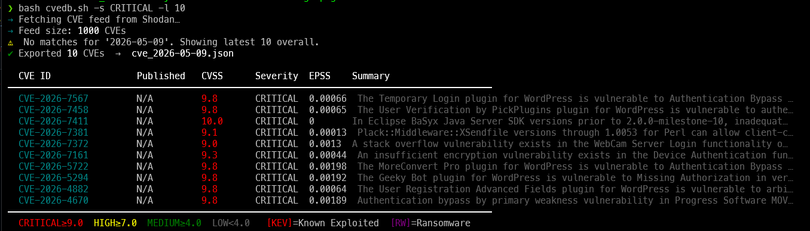

# CVE Tracker | TeamCyberOps

> [!IMPORTANT]
> Fast, terminal-native CVE tracker powered by [Shodan's CVEDB](https://cvedb.shodan.io).  
> Self-updating · Colour-coded severity · Multiple output formats · KEV/EPSS awareness

```
cvedb v2.0.0 — Shodan CVE Tracker | github.com/mohidqx/cvedb
```



---

## Install

### Option A — Automated Installation (Recommended)

Clone the repo and run the install script:
```bash
git clone https://github.com/mohidqx/cvedb.git
cd cvedb
./install.sh
```

**What the script does:**
- ✅ Detects OS and installs all dependencies (curl, jq, bc, nmap, nuclei)
- ✅ Copies both `cvedb` and `cvedb-offensive` to `/usr/local/bin/` (or custom path)
- ✅ Creates config directories (`~/.config/cvedb`, `~/.cache/cvedb`)
- ✅ Generates sample config file
- ✅ Updates PATH if needed

**Custom installation path:**
```bash
./install.sh --prefix "$HOME/.local/bin"
```

**Skip dependency installation (if pre-installed):**
```bash
./install.sh --skip-deps
```

### Option B — Manual Installation

If you prefer manual setup:

```bash
# 1. Install dependencies
sudo apt install curl jq bc nmap nuclei  # Ubuntu/Debian
brew install curl jq bc nmap nuclei      # macOS

# 2. Copy both binaries globally
sudo cp cvedb.sh /usr/local/bin/cvedb
sudo cp cvedb-offensive.sh /usr/local/bin/cvedb-offensive.sh
sudo chmod +x /usr/local/bin/cvedb /usr/local/bin/cvedb-offensive.sh

# 3. Verify installation
cvedb --version
```

### Dependencies
| Tool | Purpose | Required |
|------|---------|----------|
| `curl` | HTTP fetching | ✓ Yes |
| `jq` | JSON parsing | ✓ Yes |
| `bc` | CVSS float comparison | ✓ Yes |
| `nmap` | Port scanning | ✗ Optional (for scan command) |
| `nuclei` | Vulnerability templates | ✗ Optional (for nuclei command) |

---

## Quick Start

```bash
cvedb                      # today's top 20 CVEs
cvedb 2025-06-01           # top 20 for a specific date
cvedb -s CRITICAL -l 5     # top 5 critical only
cvedb search nginx         # keyword search
cvedb kev                  # CISA known exploited
cvedb epss 10              # top 10 by exploitation probability
cvedb show CVE-2024-1234   # full detail for one CVE
cvedb watch 30             # live-refresh every 30s
cvedb update               # self-update from GitHub
```

---

## Commands

| Command | Description |
|---------|-------------|
| `cvedb [DATE]` | Fetch & display top CVEs, optionally filtered by date |
| `cvedb show CVE-XXXX` | Full detail view for a single CVE |
| `cvedb search <term>` | Full-text search: summary, ID, vendor, CPE |
| `cvedb epss [N]` | Top N CVEs ranked by EPSS exploitation probability |
| `cvedb kev` | CISA Known Exploited Vulnerabilities only |
| `cvedb watch [sec]` | Auto-refresh live view (default: 60s) |
| `cvedb stats` | Feed statistics & top vendor breakdown |
| `cvedb update` | Self-update binary from GitHub |
| `cvedb clear-cache` | Clear the local feed cache |
| `cvedb scan <target>` | Scan target for known CVE vulnerabilities *(offensive addon)* |
| `cvedb nuclei <cve-id>` | Run Nuclei templates against CVE *(offensive addon)* |
| `cvedb poc <cve-id>` | Execute public POC for CVE *(offensive addon)* |

---

## Offensive Addon (v2.1.0+)

The optional **cvedb-offensive** addon extends cvedb with scanning and exploitation capabilities.

### Installation

Add this line to your `cvedb.sh` before `main "$@"`:
```bash
source "$(dirname "$0")/cvedb-offensive.sh"
```

Or run standalone:
```bash
./cvedb-offensive.sh poc CVE-2024-1234
```

### New Commands

| Command | Description |
|---------|-------------|
| `cvedb scan <target>` | Port scan and CVE inventory for IP/domain |
| `cvedb nuclei <cve-id>` | Run Nuclei templates against the CVE |
| `cvedb poc <cve-id>` | Download and execute public POC |

### Requirements (Offensive)

| Tool | Purpose |
|------|----------|
| `nuclei` | Vulnerability scanner |
| `nmap` | Port scanning |
| `curl` / `wget` | POC fetching |

---

## Options

| Flag | Description | Default |
|------|-------------|---------|
| `-d, --date YYYY-MM-DD` | Filter by published/modified date | today |
| `-l, --limit N` | Max results | 20 |
| `-s, --severity LEVEL` | CRITICAL \| HIGH \| MEDIUM \| LOW | (all) |
| `-f, --format FMT` | `normal` \| `wide` \| `json` \| `csv` \| `minimal` | normal |
| `-o, --output FILE` | JSON export path | `cve_DATE.json` |
| `--stats` | Append statistics after table | off |
| `--no-cache` | Skip cache, force fresh fetch | off |
| `--no-color` | Disable terminal colours | off |
| `-v, --version` | Print version | — |
| `-h, --help` | Show help | — |

---

## Output Formats

### `normal` (default)
Colour-coded table with CVSS, EPSS, severity, KEV/ransomware badges.

### `wide`
Adds separate KEV and Ransomware columns.

### `json`
Pretty-printed JSON to stdout — pipe-friendly:
```bash
cvedb -f json | jq '.[] | select(.cvss >= 9)'
```

### `csv`
Comma-separated for spreadsheet import:
```bash
cvedb -f csv -o critical.csv -s CRITICAL
```

### `minimal`
One line per CVE: `CVE-ID CVSS SEVERITY` — ideal for scripting:
```bash
cvedb -f minimal | awk '$2 >= 9 {print $1}'
```

---

## JSON Export Schema

Every run auto-exports a structured JSON file:

```json
{
  "generated_at":   "2026-05-09T11:00:00Z",
  "cvedb_version":  "2.0.0",
  "filter_date":    "2026-05-09",
  "count":          20,
  "cves": [
    {
      "cve_id":       "CVE-2026-XXXX",
      "published":    "2026-05-09T08:00:00Z",
      "modified":     "2026-05-09T10:00:00Z",
      "cvss":         9.8,
      "cvss_version": "3.1",
      "epss":         0.97312,
      "severity":     "CRITICAL",
      "kev":          true,
      "ransomware":   false,
      "summary":      "...",
      "references":   ["https://..."],
      "cpes":         ["cpe:2.3:..."],
      "vendors":      ["nginx"]
    }
  ]
}
```

---

## CVSS Colour Key

| Colour | Range | Severity |
|--------|-------|----------|
| 🔴 Red | ≥ 9.0 | CRITICAL |
| 🟡 Yellow | ≥ 7.0 | HIGH |
| 🟢 Green | ≥ 4.0 | MEDIUM |
| Gray | < 4.0 | LOW |

**Badges:**  
`[KEV]` — CISA Known Exploited Vulnerability (patch immediately)  
`[RW]` — Associated with ransomware campaigns  

---

## Caching

Feed responses are cached at `~/.cache/cvedb/feed.json` for **5 minutes** by default.
This avoids hammering the API during frequent runs.

```bash
cvedb --no-cache          # bypass cache
cvedb clear-cache         # delete cached data
```

Set `CACHE_TTL=N` in your config file to change the TTL in seconds.

---

## Config File

Create `~/.config/cvedb/config` to persist preferences:

```bash
# ~/.config/cvedb/config
LIMIT=50
CACHE_TTL=120          # seconds
SEVERITY_FILTER=""     # leave blank for all
NO_COLOR=0
```

Environment variables take precedence over config:
```bash
CVEDB_LIMIT=10 CVEDB_SEVERITY=CRITICAL cvedb
```

---

## Auto-Update

`cvedb` silently checks for new releases once per day. If an update exists, it
prints a one-line notice after your results. To update immediately:

```bash
cvedb update
```

This pulls the latest `cvedb.sh` from the `main` branch, compares semver, and
replaces the installed binary — using `sudo` automatically if needed.

---

## Advanced Examples

```bash
# All critical CVEs today as JSON, piped to another tool
cvedb -s CRITICAL -f json | jq '.[] | {cve_id, cvss, summary}'

# Daily cron report (add to crontab)
0 8 * * * /usr/local/bin/cvedb -f csv -o /var/log/cve-$(date +\%F).csv

# Watch mode with severity filter
cvedb watch 120   # refresh every 2 minutes

# Top 10 by EPSS, minimal output for alerting
cvedb epss 10 -f minimal

# Search for a specific product
cvedb search "apache"
cvedb search "CVE-2024"

# Stats overview of today's full feed
cvedb --stats

# Clear cache then fetch fresh critical CVEs
cvedb clear-cache && cvedb -s CRITICAL --no-cache -l 10
```

---

## License

MIT — see [LICENSE](LICENSE)
